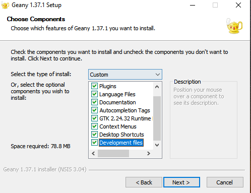

# Como configurar diferentes IDEs

Autor: Rafael Porto Vieira de Moura

[GitHub](https://github.com/rafaelportomoura)  
[Linkedin](https://www.linkedin.com/in/rafael-porto-vieira-de-moura-369307168/)

## Index: 

- [Como configurar diferentes IDEs](#como-configurar-diferentes-ides)
  - [Index:](#index)
- [Compilador MinGW](#compilador-mingw)
  - [Guia para instalação - MinGW](#guia-para-instalação---mingw)
- [VsCode](#vscode)
  - [Guia para instalação - VsCode](#guia-para-instalação---vscode)
  - [Extensões:](#extensões)
  - [Setting.json:](#settingjson)
- [Geany](#geany)
  - [Guia para instalação - Geany](#guia-para-instalação---geany)


<div class="page"/>


# Compilador MinGW

[link-mingw]: https://sourceforge.net/projects/mingw/

## Guia para instalação - MinGW

Baixe o MinGW acessando [SourceForge][link-mingw], clique depois em Download, espere o download finalizar, e execute o aplicativo mingw-get-setup.exe. Será mostrado uma tela inicial mostrando informações do Projeto.

**Passo 1:**  Clique para instalar  


**Passo 2:**  Selecione o diretório para instalação  
  

**Passo 3:**  Aguarde instalar  


**Passo 4:** Clique em Instalattion > Mark All Upgrades


**Passo 4.1:** Marque para instalar mingw32-base e o mingw32-gcc-g++.
  


**Passo 5:** Clique em Instalattion > Apply Changes.
  


**Passo 6:** Clique em Apply novamente e aguarde fazer a instalação
  

**Passo 7:** Depois de instalado pode fechar o gerenciador de instalação
  

**Passo 8:** Agora será necessário adicionar o diretório de binários do MinGW na Path do Windows, para isso, clique com o botão direito em Este Computador, e em seguida em Propriedades.


**Passo 9:** No lado direito clique em Configurações avançadas do sistema.


**Passo 10:** Clique agora em variáveis de ambiente.   


**Passo 11:** Ache a variável PATH, e clique em editar  


**Passo 12:** Clique em novo, e em seguida coloque o diretório dos binários que foram instalados com o MinGW (geralmente em C:\MinGW\bin). Em seguida clique em Ok. 


**Passo 13:** Para testar se deu certo, abra o Prompt de Comando, pressione Windows + R para abrir a caixa "Executar". Digite "cmd" e clique em "OK". 


**Passo 14:** Após abrir o prompt de comando digite “g++”.  


<div class="page"/>

# VsCode
[link-code]: https://code.visualstudio.com/download


## Guia para instalação - VsCode

Baixe o VsCode para a sua distribuição acessando [este link][link-code]. Para Windows baixe o .zip e para linux baixe o  .tar.gz. Após feito o download, abra a pasta em que  se encontra o download e siga os seguintes passos: 

**Passo 1:** Extraia os arquivos para uma pasta  
  
  

**Passo 2:**  Mova a pasta para Disco Local (C:)   
 

**Passo 3:** Mude o nome da para para VsCode-C++   


**Passo 4:** Dentro da pasta crie outra pasta chamada data    
  

**Passo 5:** Dentro de data crie outra pasta chamada tmp  


**Passo 6:** Crie um atalho de Code.exe e mova para area de trabalho 


## Extensões:
Name: C/C++

1. Name: C/C++   
   Id: ms-vscode.cpptools  
   Description: C/C++ IntelliSense, debugging, and code browsing.   
   VS Marketplace Link: https://marketplace.visualstudio.com/items?itemName=ms-vscode.cpptools

2. Name: Material Icon Theme  
   Id: pkief.material-icon-theme  
   Description: Material Design Icons for Visual Studio Code  
   VS Marketplace Link: https://marketplace.visualstudio.com/items?itemName=PKief.material-icon-theme

1. Name: One Dark Pro   
   Id: zhuangtongfa.material-theme      
   Description: Atom's iconic One Dark theme for Visual Studio Code   
   VS Marketplace Link: https://marketplace.visualstudio.com/items?itemName=zhuangtongfa.Material-theme

2. Name: Bracket Pair Colorizer   
   Id: coenraads.bracket-pair-colorizer   
   Description: A customizable extension for colorizing matching brackets   
   VS Marketplace Link: https://marketplace.visualstudio.com/items?itemName=CoenraadS.bracket-pair-colorizer   

3. Name: C/C++ Compile Run   
   Id: danielpinto8zz6.c-cpp-compile-run   
   Description: Compile & Run single c/c++ files easly   
   VS Marketplace Link: https://marketplace.visualstudio.com/items?itemName=danielpinto8zz6.c-cpp-compile-run   

## Setting.json: 

```json
{
    "workbench.iconTheme": "material-icon-theme",
    "workbench.colorTheme": "One Dark Pro",
    "workbench.startupEditor": "newUntitledFile",
    "files.autoSave": "onFocusChange",
    "editor.defaultFormatter": "ms-vscode.cpptools",
    "editor.formatOnSave": true,
    "editor.formatOnPaste": true,
    "C_Cpp.formatting": "vcFormat",
    "C_Cpp.vcFormat.indent.caseContentsWhenBlock": true,
    "C_Cpp.vcFormat.indent.accessSpecifiers": true,
    "C_Cpp.vcFormat.indent.preserveWithinParentheses": true,
    "C_Cpp.vcFormat.indent.preserveComments": true,
    "C_Cpp.vcFormat.newLine.beforeOpenBrace.block": "sameLine",
    "C_Cpp.vcFormat.space.betweenEmptySquareBrackets": true,
    "C_Cpp.vcFormat.newLine.beforeOpenBrace.function": "sameLine",
    "C_Cpp.vcFormat.newLine.beforeOpenBrace.lambda": "sameLine",
    "C_Cpp.vcFormat.newLine.beforeOpenBrace.namespace": "sameLine",
    "C_Cpp.vcFormat.newLine.beforeOpenBrace.type": "sameLine",
    "C_Cpp.vcFormat.newLine.closeBraceSameLine.emptyFunction": true,
    "C_Cpp.vcFormat.newLine.closeBraceSameLine.emptyType": true,
    "C_Cpp.vcFormat.space.insertAfterSemicolon": true,
    "C_Cpp.vcFormat.indent.withinParentheses": "alignToParenthesis",
    "C_Cpp.vcFormat.space.afterCastCloseParenthesis": false,
    "C_Cpp.vcFormat.space.withinParameterListParentheses": true,
    "C_Cpp.vcFormat.space.withinExpressionParentheses": true,
    "C_Cpp.vcFormat.space.withinCastParentheses": true,
    "C_Cpp.vcFormat.space.withinControlFlowStatementParentheses": true,
    "C_Cpp.vcFormat.space.withinSquareBrackets": false,
    "C_Cpp.vcFormat.indent.caseLabels": true,
    "C_Cpp.updateChannel": "Insiders",
    "c-cpp-compile-run.cpp-compiler": "g++",
    "c-cpp-compile-run.cpp-flags": "-Wall -Wextra",
    "c-cpp-compile-run.save-before-compile": true,

}
```

<div class="page"/>


# Geany

[link-geany]: https://www.geany.org/download/releases/
[link-download-geany]: https://download.geany.org/geany-1.37.1_setup.exe

## Guia para instalação - Geany

Link para o site com outras distribuições: [Geany][link-geany]

Baixe o Geany para Windows acessando [este link][link-download-geany], aguarde o Download finalizar e clique no programa executável geany-1.37.1_setup.exe.


**PASSO 1:**  Clique em Next >  
 

**PASSO 2:**   Clique em I agree  


**PASSO 3:**   Marque o componente Development files e clique em Next >  


**PASSO 4:**   Clique em Next >  
  

**PASSO 5:**   Clique em Install  


**PASSO 6:**  Aguarde instalar  
  

**PASSO 7:**   Clique em Finish  


